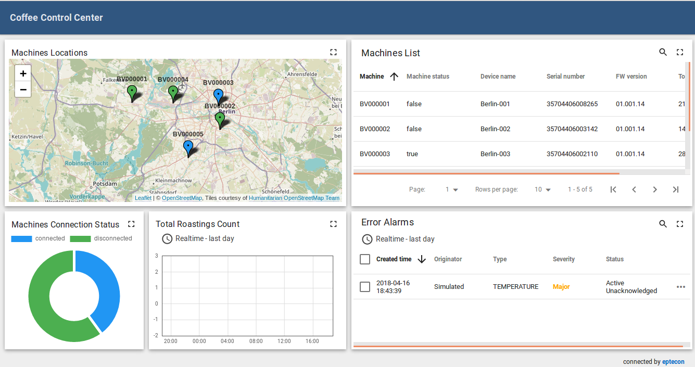

# GlueLogics 

GlueLogics is an IoT platform, based on ThingsBoard, an open-source IoT platform for data collection, processing, visualization, and device management.

## Project structure and Documentaiton

 - [addons](/addons) contains extentions for connection of external applications.
 
 - [customization](/customization) contains white labeling data and documentation about how to customize frontend and backend.
 
 - [documentation](/documentation) contains documentation about server configurations, application installation and reference manuals.
 
 - [enteties](/enteties) contains example and own dashboards, plugins and rules configurations.
 
 - [tbgateway](/tbgateway) contains all data for ThingsBoard Gateway, a connector for external IoT Platforms and Services (see also [ThingsBoard Gateway](https://thingsboard.io/docs/iot-gateway/)).
 
 - [gluelogics-1.0](/gluelogics-1.0]) contains customized ThingsBoard (v. 1.3.1) source code whitelabelled as GlueLogics.

 - [tbgateway](/tbgateway]) contains ThingsBoard Gateway for connection of external services.
 
 

Documentation for ThingsBoard is hosted on [thingsboard.io](https://thingsboard.io/docs). 

## IoT use cases

[**Coffee control Center**](http://gluelogics.iotwebtools.com/dashboards/555d2e50-11ab-11e8-85b1-2f26a206e194?publicId=c624bf50-19a7-11e8-8013-2f26a206e194)

## ThingsBoard Support/Docu

 - [Community chat](https://gitter.im/thingsboard/chat)
 - [Q&A forum](https://groups.google.com/forum/#!forum/thingsboard)
 - [Stackoverflow](http://stackoverflow.com/questions/tagged/thingsboard)
 - [YouTube Channel](https://www.youtube.com/channel/UCDb9fsV-YR4JmnipAMGsVAQ/videos)

